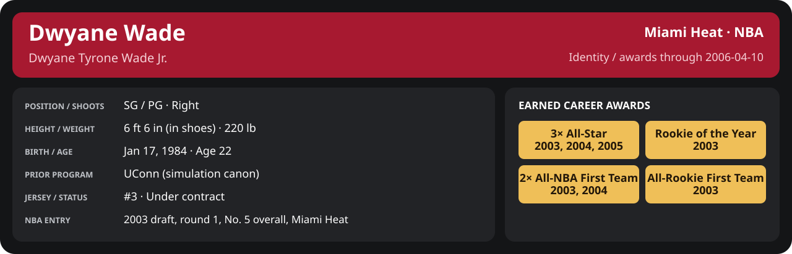

<!-- Generated by scripts/update_player_reports.py; edit source records, then rebuild. -->

# Dwyane Wade | Player career

## Professional identity

| Player | Age on report date | Team / league | Position | Number | Status |
| --- | --- | --- | --- | --- | --- |
| Dwyane Tyrone Wade Jr. | 22 | Miami Heat / NBA | SG / PG | 3 | Under contract |

| Identity field | Recorded value |
| --- | --- |
| Birth date | 1984-01-17 |
| NBA entry | 2003 draft, round 1, No. 5 overall, Miami Heat |
| Prior program | UConn (simulation canon) |
| Height, in shoes / without shoes | 6 ft 6 in / 6 ft 4.75 in |
| Weight | 220 lb |
| Wingspan / standing reach | 6 ft 11.5 in / 8 ft 7.5 in |
| Shooting hand | Right |
| Contract | Rookie scale signed 2003-07-21: three seasons plus a 2006-07 team option (2004-05: $2,361,800) |
| Role | Starting SG; staff plan 34 minutes |
| NBA debut | October 28, 2003 at Philadelphia 76ers (2003-04/06_Regular_Season/10_October/Week_4/Game_1.md) |
| Nationality | United States (born in the Chicago area; Robbins, Illinois home community, per the player profile) |
| National team | No selection recorded |
| National-team eligibility | United States (USA Basketball); no selection yet |
| Availability | No current restriction recorded in the established profile |
| Physical measurements recorded | 2003-06-25 |
| Professional status effective | 2005-10-26 |

Identity as of 2006-04-10; status snapshot dated 2005-10-26. User-established alternate-history player; historical Wade's biography and results are not this record.

[Complete professional identity](../Professional_Identity.md)

### Earned career awards

| Award | Period | Announced | Decision record |
| --- | --- | --- | --- |
| Eastern Conference Rookie of the Month | 2003-10-28 to 2003-11-30 | 2003-12-02 | [East ROM](League/2003-04/11_November/League_Awards.md#rookie-of-the-month) |
| Eastern Conference Player of the Week | 2003-12-15 to 2003-12-21 | 2003-12-22 | [East POW](League/2003-04/12_December/Week_3/League_Awards.md#player-of-the-week) |
| Eastern Conference Player of the Month | 2003-12-01 to 2003-12-31 | 2004-01-02 | [East POM](League/2003-04/12_December/League_Awards.md#player-of-the-month) |
| Eastern Conference Rookie of the Month | 2003-12-01 to 2003-12-31 | 2004-01-02 | [East ROM](League/2003-04/12_December/League_Awards.md#rookie-of-the-month) |
| Eastern Conference Player of the Week | 2003-12-29 to 2004-01-04 | 2004-01-05 | [East POW](League/2003-04/01_January/Week_1/League_Awards.md#player-of-the-week) |
| Eastern Conference Player of the Month | 2004-01-01 to 2004-01-31 | 2004-02-02 | [East POM](League/2003-04/01_January/League_Awards.md#player-of-the-month) |
| Eastern Conference Rookie of the Month | 2004-01-01 to 2004-01-31 | 2004-02-02 | [East ROM](League/2003-04/01_January/League_Awards.md#rookie-of-the-month) |
| All-Star | 2003-10-28 to 2004-02-03 | 2004-02-03 | [All-Star](League/2003-04/All_Star.md#all-stars) |
| Eastern Conference Rookie of the Month | 2004-02-01 to 2004-02-29 | 2004-03-02 | [East ROM](League/2003-04/02_February/League_Awards.md#rookie-of-the-month) |
| Eastern Conference Player of the Week | 2004-03-08 to 2004-03-14 | 2004-03-15 | [East POW](League/2003-04/03_March/Week_2/League_Awards.md#player-of-the-week) |
| Eastern Conference Player of the Month | 2004-03-01 to 2004-03-31 | 2004-04-02 | [East POM](League/2003-04/03_March/League_Awards.md#player-of-the-month) |
| Eastern Conference Rookie of the Month | 2004-03-01 to 2004-03-31 | 2004-04-02 | [East ROM](League/2003-04/03_March/League_Awards.md#rookie-of-the-month) |
| Eastern Conference Rookie of the Month | 2004-04-01 to 2004-04-14 | 2004-04-16 | [East ROM](League/2003-04/04_April/League_Awards.md#rookie-of-the-month) |
| Rookie of the Year | 2003-10-28 to 2004-04-14 | 2004-04-20 | [ROY](League/2003-04/Season_Awards.md#rookie-of-the-year) |
| All-NBA First Team | 2003-10-28 to 2004-04-14 | 2004-04-25 | [All-NBA 1st](League/2003-04/Season_Awards.md#all-nba-teams) |
| All-Rookie First Team | 2003-10-28 to 2004-04-14 | 2004-04-27 | [All-Rookie 1st](League/2003-04/Season_Awards.md#all-rookie-teams) |
| Eastern Conference Player of the Month | 2004-12-01 to 2004-12-31 | 2005-01-02 | [East POM](League/2004-05/12_December/League_Awards.md#player-of-the-month) |
| Eastern Conference Player of the Week | 2005-01-24 to 2005-01-30 | 2005-01-31 | [East POW](League/2004-05/01_January/Week_4/League_Awards.md#player-of-the-week) |
| All-Star | 2004-11-02 to 2005-02-08 | 2005-02-08 | [All-Star](League/2004-05/All_Star.md#all-stars) |
| Eastern Conference Player of the Month | 2005-03-01 to 2005-03-31 | 2005-04-02 | [East POM](League/2004-05/03_March/League_Awards.md#player-of-the-month) |
| Eastern Conference Player of the Month | 2005-04-01 to 2005-04-20 | 2005-04-22 | [East POM](League/2004-05/04_April/League_Awards.md#player-of-the-month) |
| All-NBA First Team | 2004-11-02 to 2005-04-20 | 2005-05-18 | [All-NBA 1st](League/2004-05/Season_Awards.md#all-nba-teams) |
| Eastern Conference Player of the Week | 2005-11-07 to 2005-11-13 | 2005-11-14 | [East POW](League/2005-06/11_November/Week_2/League_Awards.md#player-of-the-week) |
| Eastern Conference Player of the Week | 2005-11-14 to 2005-11-20 | 2005-11-21 | [East POW](League/2005-06/11_November/Week_3/League_Awards.md#player-of-the-week) |
| Eastern Conference Player of the Month | 2005-11-01 to 2005-11-30 | 2005-12-02 | [East POM](League/2005-06/11_November/League_Awards.md#player-of-the-month) |
| Eastern Conference Player of the Week | 2005-11-28 to 2005-12-04 | 2005-12-05 | [East POW](League/2005-06/12_December/Week_1/League_Awards.md#player-of-the-week) |
| Eastern Conference Player of the Week | 2005-12-05 to 2005-12-11 | 2005-12-12 | [East POW](League/2005-06/12_December/Week_2/League_Awards.md#player-of-the-week) |
| Eastern Conference Player of the Week | 2005-12-26 to 2006-01-01 | 2006-01-02 | [East POW](League/2005-06/01_January/Week_1/League_Awards.md#player-of-the-week) |
| All-Star | 2005-11-01 to 2006-02-02 | 2006-02-02 | [All-Star](League/2005-06/All_Star.md#all-stars) |
| Eastern Conference Player of the Month | 2006-01-01 to 2006-01-31 | 2006-02-02 | [East POM](League/2005-06/01_January/League_Awards.md#player-of-the-month) |
| Eastern Conference Player of the Month | 2006-02-01 to 2006-02-28 | 2006-03-02 | [East POM](League/2005-06/02_February/League_Awards.md#player-of-the-month) |
| Eastern Conference Player of the Week | 2006-03-13 to 2006-03-19 | 2006-03-20 | [East POW](League/2005-06/03_March/Week_3/League_Awards.md#player-of-the-week) |
| Eastern Conference Player of the Month | 2006-03-01 to 2006-03-31 | 2006-04-02 | [East POM](League/2005-06/03_March/League_Awards.md#player-of-the-month) |

## Statistics

Career cutoff: **2006-04-10**. Club competitions and national-team events have separate records.

### NBA regular season

  

[Shooting detail](Shooting.md) · [Current contract](Contract.md#current-contract) · [Contract history](Contract.md#contract-history) · [Annual award record](Awards.md)

| Scope | Age | Team | Lg | Pos | G | GS | MP | FG | FGA | FG% | 3P | 3PA | 3P% | 2P | 2PA | 2P% | eFG% | FT | FTA | FT% | ORB | DRB | TRB | AST | STL | BLK | TOV | PF | PTS | TS% (est.) | Awards |
| --- | --- | --- | --- | --- | --- | --- | --- | --- | --- | --- | --- | --- | --- | --- | --- | --- | --- | --- | --- | --- | --- | --- | --- | --- | --- | --- | --- | --- | --- | --- | --- |
| [2003-04](2003-04/README.md) | 20 | Miami Heat | NBA | SG / PG | 75 | 70 | 35.0 | 6.1 | 11.7 | .520 | 0.9 | 2.4 | .397 | 5.1 | 9.3 | .551 | .560 | 4.8 | 5.3 | .909 | 1.4 | 3.4 | 4.8 | 4.5 | 1.6 | 1.0 | 1.1 | 2.9 | 17.9 | .639 | [East ROM](League/2003-04/11_November/League_Awards.md#rookie-of-the-month), [East POW](League/2003-04/12_December/Week_3/League_Awards.md#player-of-the-week), [East POM](League/2003-04/12_December/League_Awards.md#player-of-the-month), [East ROM](League/2003-04/12_December/League_Awards.md#rookie-of-the-month), [East POW](League/2003-04/01_January/Week_1/League_Awards.md#player-of-the-week), [East POM](League/2003-04/01_January/League_Awards.md#player-of-the-month), [East ROM](League/2003-04/01_January/League_Awards.md#rookie-of-the-month), [All-Star](League/2003-04/All_Star.md#all-stars), [East ROM](League/2003-04/02_February/League_Awards.md#rookie-of-the-month), [East POW](League/2003-04/03_March/Week_2/League_Awards.md#player-of-the-week), [East POM](League/2003-04/03_March/League_Awards.md#player-of-the-month), [East ROM](League/2003-04/03_March/League_Awards.md#rookie-of-the-month), [East ROM](League/2003-04/04_April/League_Awards.md#rookie-of-the-month), [ROY](League/2003-04/Season_Awards.md#rookie-of-the-year), [All-NBA 1st](League/2003-04/Season_Awards.md#all-nba-teams), [All-Rookie 1st](League/2003-04/Season_Awards.md#all-rookie-teams) |
| [2004-05](2004-05/README.md) | 21 | Miami Heat | NBA | SG / PG | 76 | 76 | 36.2 | 7.1 | 13.4 | .530 | 1.1 | 2.7 | .429 | 5.9 | 10.7 | .555 | .573 | 6.0 | 6.4 | .932 | 1.5 | 3.9 | 5.4 | 4.0 | 1.4 | 1.2 | 1.3 | 3.0 | 21.3 | .657 | [East POM](League/2004-05/12_December/League_Awards.md#player-of-the-month), [East POW](League/2004-05/01_January/Week_4/League_Awards.md#player-of-the-week), [All-Star](League/2004-05/All_Star.md#all-stars), [East POM](League/2004-05/03_March/League_Awards.md#player-of-the-month), [East POM](League/2004-05/04_April/League_Awards.md#player-of-the-month), [All-NBA 1st](League/2004-05/Season_Awards.md#all-nba-teams) |
| [2005-06](2005-06/README.md) | 22 | Miami Heat | NBA | SG / PG | 77 | 77 | 37.3 | 9.5 | 16.7 | .567 | 1.5 | 3.1 | .469 | 8.0 | 13.6 | .590 | .611 | 6.8 | 7.3 | .939 | 1.7 | 4.1 | 5.8 | 4.2 | 1.8 | 1.3 | 1.8 | 3.3 | 27.2 | .685 | [East POW](League/2005-06/11_November/Week_2/League_Awards.md#player-of-the-week), [East POW](League/2005-06/11_November/Week_3/League_Awards.md#player-of-the-week), [East POM](League/2005-06/11_November/League_Awards.md#player-of-the-month), [East POW](League/2005-06/12_December/Week_1/League_Awards.md#player-of-the-week), [East POW](League/2005-06/12_December/Week_2/League_Awards.md#player-of-the-week), [East POW](League/2005-06/01_January/Week_1/League_Awards.md#player-of-the-week), [All-Star](League/2005-06/All_Star.md#all-stars), [East POM](League/2005-06/01_January/League_Awards.md#player-of-the-month), [East POM](League/2005-06/02_February/League_Awards.md#player-of-the-month), [East POW](League/2005-06/03_March/Week_3/League_Awards.md#player-of-the-week), [East POM](League/2005-06/03_March/League_Awards.md#player-of-the-month) |
| Career total | 22 | Miami Heat | NBA | SG / PG | 228 | 223 | 36.2 | 7.6 | 14.0 | .542 | 1.2 | 2.7 | .435 | 6.4 | 11.2 | .568 | .585 | 5.9 | 6.3 | .929 | 1.5 | 3.8 | 5.3 | 4.2 | 1.6 | 1.2 | 1.4 | 3.1 | 22.2 | .663 | [East ROM](League/2003-04/11_November/League_Awards.md#rookie-of-the-month), [East POW](League/2003-04/12_December/Week_3/League_Awards.md#player-of-the-week), [East POM](League/2003-04/12_December/League_Awards.md#player-of-the-month), [East ROM](League/2003-04/12_December/League_Awards.md#rookie-of-the-month), [East POW](League/2003-04/01_January/Week_1/League_Awards.md#player-of-the-week), [East POM](League/2003-04/01_January/League_Awards.md#player-of-the-month), [East ROM](League/2003-04/01_January/League_Awards.md#rookie-of-the-month), [All-Star](League/2003-04/All_Star.md#all-stars), [East ROM](League/2003-04/02_February/League_Awards.md#rookie-of-the-month), [East POW](League/2003-04/03_March/Week_2/League_Awards.md#player-of-the-week), [East POM](League/2003-04/03_March/League_Awards.md#player-of-the-month), [East ROM](League/2003-04/03_March/League_Awards.md#rookie-of-the-month), [East ROM](League/2003-04/04_April/League_Awards.md#rookie-of-the-month), [ROY](League/2003-04/Season_Awards.md#rookie-of-the-year), [All-NBA 1st](League/2003-04/Season_Awards.md#all-nba-teams), [All-Rookie 1st](League/2003-04/Season_Awards.md#all-rookie-teams), [East POM](League/2004-05/12_December/League_Awards.md#player-of-the-month), [East POW](League/2004-05/01_January/Week_4/League_Awards.md#player-of-the-week), [All-Star](League/2004-05/All_Star.md#all-stars), [East POM](League/2004-05/03_March/League_Awards.md#player-of-the-month), [East POM](League/2004-05/04_April/League_Awards.md#player-of-the-month), [All-NBA 1st](League/2004-05/Season_Awards.md#all-nba-teams), [East POW](League/2005-06/11_November/Week_2/League_Awards.md#player-of-the-week), [East POW](League/2005-06/11_November/Week_3/League_Awards.md#player-of-the-week), [East POM](League/2005-06/11_November/League_Awards.md#player-of-the-month), [East POW](League/2005-06/12_December/Week_1/League_Awards.md#player-of-the-week), [East POW](League/2005-06/12_December/Week_2/League_Awards.md#player-of-the-week), [East POW](League/2005-06/01_January/Week_1/League_Awards.md#player-of-the-week), [All-Star](League/2005-06/All_Star.md#all-stars), [East POM](League/2005-06/01_January/League_Awards.md#player-of-the-month), [East POM](League/2005-06/02_February/League_Awards.md#player-of-the-month), [East POW](League/2005-06/03_March/Week_3/League_Awards.md#player-of-the-week), [East POM](League/2005-06/03_March/League_Awards.md#player-of-the-month) |

G and GS are counts; MP and counting statistics are **per appearance**. Shooting uses **.500 = 50.0%**. Age is at the row's cutoff. Scroll horizontally for every column.

Awards are confirmed through 2006-04-10, filed by the honor's period-end date; the banner shows career awards known at the page's identity cutoff.

### NBA playoffs

  

[Shooting detail](Shooting.md) · [Current contract](Contract.md#current-contract) · [Contract history](Contract.md#contract-history) · [Annual award record](Awards.md)

| Scope | Age | Team | Lg | Pos | G | GS | MP | FG | FGA | FG% | 3P | 3PA | 3P% | 2P | 2PA | 2P% | eFG% | FT | FTA | FT% | ORB | DRB | TRB | AST | STL | BLK | TOV | PF | PTS | TS% (est.) | Awards |
| --- | --- | --- | --- | --- | --- | --- | --- | --- | --- | --- | --- | --- | --- | --- | --- | --- | --- | --- | --- | --- | --- | --- | --- | --- | --- | --- | --- | --- | --- | --- | --- |
| [2003-04](../2003-04/08_Playoffs/README.md) | 20 | Miami Heat | NBA | SG / PG | 2 | 2 | 26.0 | 3.5 | 6.5 | .538 | 1.5 | 2.0 | .750 | 2.0 | 4.5 | .444 | .654 | 2.0 | 2.0 | 1.000 | 1.0 | 3.0 | 4.0 | 4.0 | 1.0 | 1.0 | 1.0 | 4.5 | 10.5 | .711 | — |
| [2004-05](../2004-05/08_Playoffs/README.md) | 21 | Miami Heat | NBA | SG / PG | 12 | 12 | 36.8 | 7.2 | 14.5 | .500 | 1.4 | 3.2 | .436 | 5.8 | 11.2 | .519 | .549 | 4.6 | 4.8 | .948 | 1.2 | 3.6 | 4.8 | 4.9 | 1.8 | 1.3 | 1.1 | 2.8 | 20.5 | .616 | — |
| [2005-06](../2005-06/08_Playoffs/README.md) | 22 | Miami Heat | NBA | SG / PG | 0 | N/A | N/A | N/A | N/A | N/A | N/A | N/A | N/A | N/A | N/A | N/A | N/A | N/A | N/A | N/A | N/A | N/A | N/A | N/A | N/A | N/A | N/A | N/A | N/A | N/A | — |
| Career total | 22 | Miami Heat | NBA | SG / PG | 14 | 14 | 35.2 | 6.7 | 13.4 | .503 | 1.4 | 3.1 | .465 | 5.3 | 10.3 | .514 | .556 | 4.2 | 4.4 | .952 | 1.2 | 3.5 | 4.7 | 4.8 | 1.6 | 1.3 | 1.1 | 3.1 | 19.1 | .623 | — |

G and GS are counts; MP and counting statistics are **per appearance**. Shooting uses **.500 = 50.0%**. Age is at the row's cutoff. Scroll horizontally for every column.

Awards are confirmed through 2006-04-10, filed by the honor's period-end date; the banner shows career awards known at the page's identity cutoff.

### Browse

[2003-04 all competitions](../2003-04/README.md) · [2004-05 all competitions](../2004-05/README.md) · [2005-06 all competitions](../2005-06/README.md)

[Earned awards](../Awards.md) · [National team / FIBA](../National_Team/README.md) · [Stats definitions](../../../docs/player_statistics.md) · [Filled example](../../../docs/examples/player_stats_preview.md) · [Miami records](Team/README.md) · [League records and awards](League/README.md)

[Open your live career milestones](../Milestones/index.html) · [Detailed Shooting, Contract and Awards](player_cards.html) · [Every player's contract](../Contracts/index.html)
