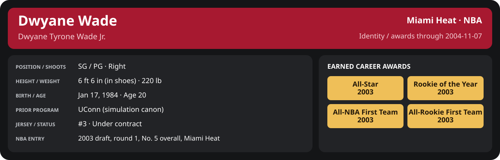

<!-- Generated by scripts/update_player_reports.py; edit source records, then rebuild. -->

# Dwyane Wade | Player career

## Professional identity

| Player | Age on report date | Team / league | Position | Number | Status |
| --- | --- | --- | --- | --- | --- |
| Dwyane Tyrone Wade Jr. | 20 | Miami Heat / NBA | SG / PG | 3 | Under contract |

| Identity field | Recorded value |
| --- | --- |
| Birth date | 1984-01-17 |
| NBA entry | 2003 draft, round 1, No. 5 overall, Miami Heat |
| Prior program | UConn (simulation canon) |
| Height, in shoes / without shoes | 6 ft 6 in / 6 ft 4.75 in |
| Weight | 220 lb |
| Wingspan / standing reach | 6 ft 11.5 in / 8 ft 7.5 in |
| Shooting hand | Right |
| Contract | Rookie scale signed 2003-07-21: three seasons plus a 2006-07 team option (2004-05: $2,361,800) |
| Role | Starting SG; staff plan 34 minutes |
| NBA debut | October 28, 2003 at Philadelphia 76ers (2003-04/06_Regular_Season/10_October/Week_4/Game_1.md) |
| Nationality | United States (born in the Chicago area; Robbins, Illinois home community, per the player profile) |
| National team | No selection recorded |
| National-team eligibility | United States (USA Basketball); no selection yet |
| Availability | No current restriction recorded in the established profile |
| Physical measurements recorded | 2003-06-25 |
| Professional status effective | 2004-10-28 |

Identity as of 2004-11-07; status snapshot dated 2004-10-28. User-established alternate-history player; historical Wade's biography and results are not this record.

[Complete professional identity](../Professional_Identity.md)

### Earned career awards

| Award | Period | Announced | Decision record |
| --- | --- | --- | --- |
| Eastern Conference Rookie of the Month | 2003-10-28 to 2003-11-30 | 2003-12-02 | [East ROM](League/2003-04/11_November/League_Awards.md#rookie-of-the-month) |
| Eastern Conference Player of the Week | 2003-12-15 to 2003-12-21 | 2003-12-22 | [East POW](League/2003-04/12_December/Week_3/League_Awards.md#player-of-the-week) |
| Eastern Conference Player of the Month | 2003-12-01 to 2003-12-31 | 2004-01-02 | [East POM](League/2003-04/12_December/League_Awards.md#player-of-the-month) |
| Eastern Conference Rookie of the Month | 2003-12-01 to 2003-12-31 | 2004-01-02 | [East ROM](League/2003-04/12_December/League_Awards.md#rookie-of-the-month) |
| Eastern Conference Player of the Week | 2003-12-29 to 2004-01-04 | 2004-01-05 | [East POW](League/2003-04/01_January/Week_1/League_Awards.md#player-of-the-week) |
| Eastern Conference Player of the Month | 2004-01-01 to 2004-01-31 | 2004-02-02 | [East POM](League/2003-04/01_January/League_Awards.md#player-of-the-month) |
| Eastern Conference Rookie of the Month | 2004-01-01 to 2004-01-31 | 2004-02-02 | [East ROM](League/2003-04/01_January/League_Awards.md#rookie-of-the-month) |
| All-Star | 2003-10-28 to 2004-02-03 | 2004-02-03 | [All-Star](League/2003-04/All_Star.md#all-stars) |
| Eastern Conference Rookie of the Month | 2004-02-01 to 2004-02-29 | 2004-03-02 | [East ROM](League/2003-04/02_February/League_Awards.md#rookie-of-the-month) |
| Eastern Conference Player of the Week | 2004-03-08 to 2004-03-14 | 2004-03-15 | [East POW](League/2003-04/03_March/Week_2/League_Awards.md#player-of-the-week) |
| Eastern Conference Player of the Month | 2004-03-01 to 2004-03-31 | 2004-04-02 | [East POM](League/2003-04/03_March/League_Awards.md#player-of-the-month) |
| Eastern Conference Rookie of the Month | 2004-03-01 to 2004-03-31 | 2004-04-02 | [East ROM](League/2003-04/03_March/League_Awards.md#rookie-of-the-month) |
| Eastern Conference Rookie of the Month | 2004-04-01 to 2004-04-14 | 2004-04-16 | [East ROM](League/2003-04/04_April/League_Awards.md#rookie-of-the-month) |
| Rookie of the Year | 2003-10-28 to 2004-04-14 | 2004-04-20 | [ROY](League/2003-04/Season_Awards.md#rookie-of-the-year) |
| All-NBA First Team | 2003-10-28 to 2004-04-14 | 2004-04-25 | [All-NBA 1st](League/2003-04/Season_Awards.md#all-nba-teams) |
| All-Rookie First Team | 2003-10-28 to 2004-04-14 | 2004-04-27 | [All-Rookie 1st](League/2003-04/Season_Awards.md#all-rookie-teams) |

## Statistics

Career cutoff: **2004-11-07**. Club competitions and national-team events have separate records.

### NBA regular season

  

[Shooting detail](Shooting.md) · [Current contract](Contract.md#current-contract) · [Contract history](Contract.md#contract-history) · [Annual award record](Awards.md)

| Scope | Age | Team | Lg | Pos | G | GS | MP | FG | FGA | FG% | 3P | 3PA | 3P% | 2P | 2PA | 2P% | eFG% | FT | FTA | FT% | ORB | DRB | TRB | AST | STL | BLK | TOV | PF | PTS | TS% (est.) | Awards |
| --- | --- | --- | --- | --- | --- | --- | --- | --- | --- | --- | --- | --- | --- | --- | --- | --- | --- | --- | --- | --- | --- | --- | --- | --- | --- | --- | --- | --- | --- | --- | --- |
| [2003-04](2003-04/README.md) | 20 | Miami Heat | NBA | SG / PG | 75 | 70 | 35.0 | 6.1 | 11.7 | .520 | 0.9 | 2.4 | .397 | 5.1 | 9.3 | .551 | .560 | 4.8 | 5.3 | .909 | 1.4 | 3.4 | 4.8 | 4.5 | 1.6 | 1.0 | 1.1 | 2.9 | 17.9 | .639 | [East ROM](League/2003-04/11_November/League_Awards.md#rookie-of-the-month), [East POW](League/2003-04/12_December/Week_3/League_Awards.md#player-of-the-week), [East POM](League/2003-04/12_December/League_Awards.md#player-of-the-month), [East ROM](League/2003-04/12_December/League_Awards.md#rookie-of-the-month), [East POW](League/2003-04/01_January/Week_1/League_Awards.md#player-of-the-week), [East POM](League/2003-04/01_January/League_Awards.md#player-of-the-month), [East ROM](League/2003-04/01_January/League_Awards.md#rookie-of-the-month), [All-Star](League/2003-04/All_Star.md#all-stars), [East ROM](League/2003-04/02_February/League_Awards.md#rookie-of-the-month), [East POW](League/2003-04/03_March/Week_2/League_Awards.md#player-of-the-week), [East POM](League/2003-04/03_March/League_Awards.md#player-of-the-month), [East ROM](League/2003-04/03_March/League_Awards.md#rookie-of-the-month), [East ROM](League/2003-04/04_April/League_Awards.md#rookie-of-the-month), [ROY](League/2003-04/Season_Awards.md#rookie-of-the-year), [All-NBA 1st](League/2003-04/Season_Awards.md#all-nba-teams), [All-Rookie 1st](League/2003-04/Season_Awards.md#all-rookie-teams) |
| [2004-05](2004-05/README.md) | 20 | Miami Heat | NBA | SG / PG | 3 | 3 | 31.1 | 4.7 | 9.0 | .519 | 1.0 | 2.0 | .500 | 3.7 | 7.0 | .524 | .574 | 4.7 | 5.0 | .933 | 1.3 | 2.0 | 3.3 | 3.3 | 1.3 | 0.7 | 1.3 | 1.7 | 15.0 | .670 | — |
| Career total | 20 | Miami Heat | NBA | SG / PG | 78 | 73 | 34.8 | 6.0 | 11.6 | .520 | 0.9 | 2.4 | .400 | 5.1 | 9.2 | .551 | .561 | 4.8 | 5.3 | .910 | 1.4 | 3.4 | 4.7 | 4.5 | 1.6 | 1.0 | 1.1 | 2.9 | 17.8 | .639 | [East ROM](League/2003-04/11_November/League_Awards.md#rookie-of-the-month), [East POW](League/2003-04/12_December/Week_3/League_Awards.md#player-of-the-week), [East POM](League/2003-04/12_December/League_Awards.md#player-of-the-month), [East ROM](League/2003-04/12_December/League_Awards.md#rookie-of-the-month), [East POW](League/2003-04/01_January/Week_1/League_Awards.md#player-of-the-week), [East POM](League/2003-04/01_January/League_Awards.md#player-of-the-month), [East ROM](League/2003-04/01_January/League_Awards.md#rookie-of-the-month), [All-Star](League/2003-04/All_Star.md#all-stars), [East ROM](League/2003-04/02_February/League_Awards.md#rookie-of-the-month), [East POW](League/2003-04/03_March/Week_2/League_Awards.md#player-of-the-week), [East POM](League/2003-04/03_March/League_Awards.md#player-of-the-month), [East ROM](League/2003-04/03_March/League_Awards.md#rookie-of-the-month), [East ROM](League/2003-04/04_April/League_Awards.md#rookie-of-the-month), [ROY](League/2003-04/Season_Awards.md#rookie-of-the-year), [All-NBA 1st](League/2003-04/Season_Awards.md#all-nba-teams), [All-Rookie 1st](League/2003-04/Season_Awards.md#all-rookie-teams) |

G and GS are counts; MP and counting statistics are **per appearance**. Shooting uses **.500 = 50.0%**. Age is at the row's cutoff. Scroll horizontally for every column.

Awards are confirmed through 2004-11-07, filed by the honor's period-end date; the banner shows career awards known at the page's identity cutoff.

### NBA playoffs

  

[Shooting detail](Shooting.md) · [Current contract](Contract.md#current-contract) · [Contract history](Contract.md#contract-history) · [Annual award record](Awards.md)

| Scope | Age | Team | Lg | Pos | G | GS | MP | FG | FGA | FG% | 3P | 3PA | 3P% | 2P | 2PA | 2P% | eFG% | FT | FTA | FT% | ORB | DRB | TRB | AST | STL | BLK | TOV | PF | PTS | TS% (est.) | Awards |
| --- | --- | --- | --- | --- | --- | --- | --- | --- | --- | --- | --- | --- | --- | --- | --- | --- | --- | --- | --- | --- | --- | --- | --- | --- | --- | --- | --- | --- | --- | --- | --- |
| [2003-04](../2003-04/08_Playoffs/README.md) | 20 | Miami Heat | NBA | SG / PG | 2 | 2 | 26.0 | 3.5 | 6.5 | .538 | 1.5 | 2.0 | .750 | 2.0 | 4.5 | .444 | .654 | 2.0 | 2.0 | 1.000 | 1.0 | 3.0 | 4.0 | 4.0 | 1.0 | 1.0 | 1.0 | 4.5 | 10.5 | .711 | — |
| [2004-05](../2004-05/08_Playoffs/README.md) | 20 | Miami Heat | NBA | SG / PG | 0 | N/A | N/A | N/A | N/A | N/A | N/A | N/A | N/A | N/A | N/A | N/A | N/A | N/A | N/A | N/A | N/A | N/A | N/A | N/A | N/A | N/A | N/A | N/A | N/A | N/A | — |
| Career total | 20 | Miami Heat | NBA | SG / PG | 2 | 2 | 26.0 | 3.5 | 6.5 | .538 | 1.5 | 2.0 | .750 | 2.0 | 4.5 | .444 | .654 | 2.0 | 2.0 | 1.000 | 1.0 | 3.0 | 4.0 | 4.0 | 1.0 | 1.0 | 1.0 | 4.5 | 10.5 | .711 | — |

G and GS are counts; MP and counting statistics are **per appearance**. Shooting uses **.500 = 50.0%**. Age is at the row's cutoff. Scroll horizontally for every column.

Awards are confirmed through 2004-11-07, filed by the honor's period-end date; the banner shows career awards known at the page's identity cutoff.

### Browse

[2003-04 all competitions](../2003-04/README.md) · [2004-05 all competitions](../2004-05/README.md)

[Earned awards](../Awards.md) · [National team / FIBA](../National_Team/README.md) · [Stats definitions](../../../docs/player_statistics.md) · [Filled example](../../../docs/examples/player_stats_preview.md) · [Miami records](Team/README.md) · [League records and awards](League/README.md)

[Open your live career milestones](../Milestones/index.html) · [Detailed Shooting, Contract and Awards](player_cards.html) · [Every player's contract](../Contracts/index.html)
