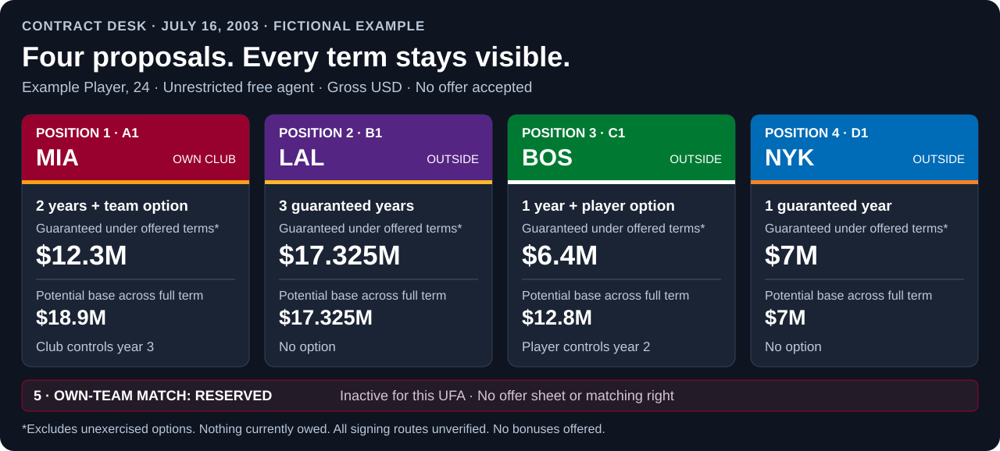
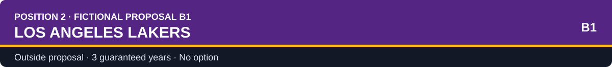
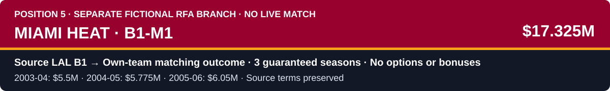

# Contract desk | Example Player

> **FICTIONAL DESIGN EXAMPLE.** Four hypothetical proposals for an invented player, dated July 16, 2003. These are not historical NBA offers, Wade's negotiation, or executable contracts. The main example is unrestricted free agency. A separately labeled restricted-free-agency branch demonstrates the reserved fifth matching slot.

[All previews](README.md) · [Interactive contract desk](contract_negotiation_preview.html) · [Reusable contract template](../../templates/player_milestones/contract_negotiation.md) · [Free-agency preview](free_agency.md) · [Research and era checks](../../templates/player_milestones/contract_negotiation_research.md)

| Player / age | Basketball identity | Market status in this example | Own / previous club | Snapshot |
| --- | --- | --- | --- | --- |
| Example Player / 24 | SG; secondary ball-handler | UFA, assumed for this fictional scenario | Miami Heat | July 16, 2003; A1, B1, C1 and D1 |

**Now:** Miami's retention proposal and three outside proposals are together on one page. No offer has been accepted, rejected or signed. Your stated preference is still open.

**Your decision:** choose a negotiating priority, instruct a counter, reject a proposal, or continue the eligible market process. You may identify a preferred structure, but this example cannot produce a live acceptance because signing routes and applicable terms remain unverified.

**Timing:** no firm expiry, option deadline, meeting time or exclusivity period has been supplied. Unknown does not mean unlimited time. Your representative must ask each club to confirm its actual deadline in writing.

## Four ordinary offers, one comparison

All amounts are gross base salary in US dollars. **Guaranteed under offered terms** means proposed protected base salary if the agreement is validly executed, subject to its actual protection language. Nothing is currently owed. Potential salary includes conditional option years; it is not an earnings forecast.

| Decision point | 1 · MIA · A1 · Own club | 2 · LAL · B1 | 3 · BOS · C1 | 4 · NYK · D1 |
| --- | --- | --- | --- | --- |
| Club | Miami Heat | Los Angeles Lakers | Boston Celtics | New York Knicks |
| Version / status | A1 / hypothetical, open | B1 / hypothetical, open | C1 / hypothetical, open | D1 / hypothetical, open |
| Offered term | 2 guaranteed years + year-3 team option | 3 guaranteed years | 1 guaranteed year + year-2 player option | 1 guaranteed year |
| **Guaranteed under offered terms, excluding unexercised options** | **$12,300,000** | **$17,325,000** | **$6,400,000** | **$7,000,000** |
| **Potential base salary across full offered term** | **$18,900,000** | **$17,325,000** | **$12,800,000** | **$7,000,000** |
| First-season salary | $6,000,000 | $5,500,000 | $6,400,000 | $7,000,000 |
| Full-term average, if all offered years occur | $6,300,000 over 3 years | $5,775,000 over 3 years | $6,400,000 over 2 years | $7,000,000 over 1 year |
| Additional option salary | $6,600,000 | None | $6,400,000 | None |
| Who controls the option? | Miami, subject to verified terms | No option | Player, subject to verified terms | No option |
| Earliest possible new market window | 2005 offseason if Miami declines year 3 | 2006 offseason after year 3 | 2004 offseason if player declines year 2 | 2004 offseason after year 1 |
| If option exercised | $6.6M year 3 enters the term under verified option terms | Not applicable | $6.4M year 2 enters the term under verified option terms | Not applicable |
| Signing / performance bonuses | None offered | None offered | None offered | None offered |
| Contractual trade-consent clause | None offered | None offered | None offered | None offered |
| Fictional basketball plan | Main-rotation secondary creator | Rotation guard; narrower creation role | Shared creation; discuss primary-handler units | Larger creation workload |
| Main advantage | Two protected years; higher three-year ceiling | Highest unconditional proposed protection | Player controls whether to keep year 2 | Highest first-year salary; shortest commitment |
| Main exposure | Club can keep the upside year or decline it | Three-year commitment; no contracted early exit | Option procedure remains unverified | No second-season income under this proposal |
| Signing route / cap feasibility | Unresolved: room or qualifying rights must be proved | Unresolved: room or qualifying rights must be proved | Unresolved: room or qualifying rights must be proved | Unresolved: room or qualifying rights must be proved |
| Available now | Review, counter, decline, or prefer conditionally | Review, counter, decline, or prefer conditionally | Review, counter, decline, or prefer conditionally | Review, counter, decline, or prefer conditionally |

Boston's player option is economically different from Miami's team option. Both are excluded from the unconditional column until exercised, but **Boston's second season is proposed player-controlled protection**: the player could elect to remain on the stated salary if the verified terms permit. Miami's third season depends on the club's election. Comparing only $12.3M against $6.4M would conceal that distinction.

The offseason labels describe the proposed lengths, not exact contract-end dates, option deadlines, a verified future UFA status, or legal signing windows. Role descriptions are fictional discussion points, not historical plans or guarantees of minutes and starts.

### Reserved position 5 · Own-team matching outcome

| Fixed slot | State in the main example | Amount | Available response |
| --- | --- | --- | --- |
| **5 · MIA · Matching outcome** | **Inactive: this player is assumed to be a UFA.** No RFA offer sheet, matching right or match exists here. | Not applicable, not $0 | None. Miami may revise A1 through ordinary negotiation; that is not a match. |

Slots 1 to 4 hold ordinary proposals. Slot 5 is reserved for an applicable own-team match and never replaces an ordinary offer to make room. A matching outcome appears there only when the source offer sheet, valid receipt and actual match action are recorded. It is a linked outcome of that sheet, not a fifth independent bid. [See the separate RFA branch](#alternative-scenario-restricted-free-agency-and-slot-5).

## Every dollar, season by season

**G** = base salary guaranteed under proposed terms if validly executed. **TO** = team option. **PO** = player option. **Outside term** = no salary offered for that season; future earnings are unknown.

| Season / calculation | 1 · MIA A1 | 2 · LAL B1 | 3 · BOS C1 | 4 · NYK D1 |
| --- | ---: | ---: | ---: | ---: |
| 2003-04 | $6,000,000 G | $5,500,000 G | $6,400,000 G | $7,000,000 G |
| 2004-05 | $6,300,000 G | $5,775,000 G | $6,400,000 PO | Outside term |
| 2005-06 | $6,600,000 TO | $6,050,000 G | Outside term | Outside term |
| **Unconditional proposed base total** | **$12,300,000** | **$17,325,000** | **$6,400,000** | **$7,000,000** |
| Conditional option amount | $6,600,000, club-controlled | None | $6,400,000, player-controlled | None |
| **Potential total under this proposal alone** | **$18,900,000** | **$17,325,000** | **$12,800,000** | **$7,000,000** |
| Year-2 change from year 1 | +$300,000 | +$275,000 | $0, if PO exercised | Not applicable |
| Year-3 change from year 2 | +$300,000, if TO exercised | +$275,000 | Not applicable | Not applicable |

Miami's annual increases are $300,000, equal to 5% of first-year salary each year. Los Angeles's are $275,000, also 5% of first-year salary. These calculations describe the proposals; they do not certify a club's legal route to offer the starting salary or resulting schedule.

### Compare equal time periods before choosing

Different lengths make headline totals misleading. These comparisons use the same three-season horizon and assign no value to future unsigned contracts.

| Comparison | Exact arithmetic | Decision meaning |
| --- | --- | --- |
| Miami versus Lakers, unconditional proposed protection | $17.325M − $12.3M = **$5.025M more with LAL** | LAL proposes another protected year. Miami's larger headline contains its own option. |
| Miami versus Lakers, if Miami exercises year 3 | $18.9M − $17.325M = **$1.575M more with MIA** | This upside depends on Miami's decision; no exercise probability is assumed. |
| New York first-year premium over Lakers | $7M − $5.5M = **$1.5M more in 2003-04** | The premium buys no contracted protection for either following season. |
| New York, future earnings needed to equal LAL over 3 seasons | $17.325M − $7M = **$10.325M over the next 2 seasons** | A comparison threshold, not an available future contract. |
| Boston, if player exercises year 2 | **$12.8M over 2 seasons** | The player could keep the second-year salary if the option is valid and properly exercised. |
| Boston after exercising year 2, year-3 earnings needed to equal LAL | $17.325M − $12.8M = **$4.525M in 2005-06** | No such future offer is assumed to exist. |
| Boston after declining year 2, future earnings needed to equal LAL | $17.325M − $6.4M = **$10.925M over the next 2 seasons** | Declining gives up the proposed $6.4M fallback for that season. |

These are nominal gross comparisons. No after-tax ranking, net present value, agent deduction, escrow deduction, relocation estimate, endorsement forecast, future salary or cap-room projection has been invented. A player-specific comparison needs documented assumptions. Cap charges and payment timing require their own schedules; neither is established by full-term average salary.

## Detailed term sheets

<strong>1 · Miami Heat · A1 · Two protected seasons; club controls the third</strong>

| Term | Proposed detail | Verification or negotiating point |
| --- | --- | --- |
| Relationship | Own / previous club in this fictional example | Prior club alone does not prove Bird, Early Bird or other signing rights. |
| Term / salary | $6M / $6.3M / $6.6M TO | Keep the first two protected years separate from the final option year. |
| Protection | First 2 seasons described as fully protected; actual language absent | Obtain protection against relevant termination grounds, injury terms, exclusions, offsets and conditions. No unstated waiver or guarantee date is assumed. |
| Option | Miami controls 2005-06 | Verify deadline, recipient, notice method and protection after exercise. All are unresolved. |
| Bonuses | No signing or performance bonus offered | Any later bonus requires a new version, earning conditions and cap treatment. |
| Trade terms | No contractual veto or trade bonus offered | Check independent rights under the applicable agreement before implying a veto or unrestricted assignability. |
| Payment dates | Not supplied | Annual salary does not establish installments, advances or deferred payments. |
| Signing route | Not identified | Prove applicable rights or usable room, including relevant holds and charges. |
| Basketball plan | Fictional main-rotation secondary creator; no speaker or meeting record | Ask about second-unit handling, changes after an acquisition, and a role-review meeting. No promised minutes or starts. |
| Player exposure | Club can retain year 3 after a breakout or decline it after a disappointing period, subject to the terms | Decide what compensation makes club control acceptable. |
| First possible counter | A2 request: same salaries; guarantee year 3 | Adds $6.6M unconditional proposed protection without increasing potential total. Unsubmitted, not an accepted revision. |
| Alternative counter | Ask for a player-option structure or a 2-year agreement | Changes control and market timing; Miami can refuse or change its price. Legality remains unverified. |
| Missing acceptance packet | Salary route; protection language; option procedure; complete agreement; expiry | Live acceptance remains blocked. |

**Representative's question:** “Is year-three club control essential? If it is, quote the salary and protection for a two-year agreement so we can compare complete alternatives.”

<strong>2 · Los Angeles Lakers · B1 · Highest unconditional protection: three guaranteed seasons</strong>

| Term | Proposed detail | Verification or negotiating point |
| --- | --- | --- |
| Term / salary | $5.5M / $5.775M / $6.05M | $17.325M across 3 guaranteed seasons; no option salary in the total. |
| Protection | All 3 seasons described as fully protected; actual language absent | Review termination grounds, injury terms, exclusions and offsets. The headline is not a substitute for the text. |
| Option / exit | No option proposed | No early unilateral exit or renegotiation right is being offered. |
| Bonuses | No signing or performance bonus offered | No bonus belongs in the $17.325M. |
| Trade terms | No contractual veto or trade bonus offered | Salary protection and a right to stay with the same team are different. Check any independent consent right. |
| Payment dates | Not supplied | Compare actual dates if a draft later introduces advances or deferrals. |
| Signing route | Not identified | The $5.5M starting salary needs a verified route. Do not label it an available exception by resemblance to another season's amount. |
| Basketball plan | Fictional rotation guard with a narrower creation role | Ask about rotation competition, ball-handling assignments, development access and review process. Do not infer historical coaches' promises. |
| Player exposure | Lower first-year pay and less proposed creation responsibility | The $5.025M protection advantage over Miami may justify the fit compromise for a security-first player. This player's priorities remain unset. |
| First possible counter | B2 request: $6M / $6.3M / $6.6M, all guaranteed | Both potential and unconditional proposed total rise $1.575M to $18.9M. Unsubmitted; legality unverified. |
| Alternative counter | Keep B1 money; request a clear development and role-review plan | Records coaching expectations without guaranteed minutes or starts. |
| Missing acceptance packet | Salary route; final protection text; payment dates; expiry; signing conditions | Live acceptance remains blocked. |

**Representative's question:** “If the player takes the longer commitment, can you improve the guaranteed salary schedule? Separately, who can meet with him about the proposed role before he decides?”

<strong>3 · Boston Celtics · C1 · Player flexibility: year-two option belongs to the player</strong>

| Term | Proposed detail | Verification or negotiating point |
| --- | --- | --- |
| Term / salary | $6.4M / $6.4M PO | $6.4M unconditional under proposed terms; $12.8M potential with option exercise. |
| Protection | First season described as fully protected | Obtain exact text and establish protection applying to year 2 after exercise. |
| Option / control | Player option for second season | Verify election window, notice method and consequences of election or non-election. No deadline or default is invented. |
| Bonuses | No signing or performance bonus offered | No bonuses in either total. |
| Trade terms | No contractual veto or trade bonus offered | Review contract and player history for separate rights. The option is not itself a trade veto. |
| Payment dates | Not supplied | No assumed lump sum, advance or deferral. |
| Signing route | Not identified | Verify room or applicable rights; a flexible term does not remove cap constraints. |
| Basketball plan | Fictional shared creation; discuss primary-handler units | Ask who decides the assignments, how they are reviewed, and what happens if the rotation changes. |
| Player exposure | One unconditional year understates the usefulness of a player-controlled fallback, but legal option details are absent | Compare the valid option right as well as the guaranteed headline. Do not presume a stronger future market. |
| First possible counter | C2 request: $6.4M / $6.72M PO | Adds $320,000 conditional player-controlled salary; potential becomes $13.12M. No added unconditional protection before exercise. Unsubmitted; legality unverified. |
| Alternative counter | Ask for 2 guaranteed seasons at $6.4M / $6.4M | Exchanges the early exit choice for unconditional protection of the second season. No choice has been made. |
| Missing acceptance packet | Signing route; valid PO text; protection after exercise; notice rules; expiry | Live acceptance and any future option action remain blocked. |

**Representative's question:** “Please provide the complete player-option language. Exactly how does the player preserve the second year, and does any condition limit that choice?”

<strong>4 · New York Knicks · D1 · Highest first-year pay: one-year agreement</strong>

| Term | Proposed detail | Verification or negotiating point |
| --- | --- | --- |
| Term / salary | $7M in 2003-04 | One-season agreement; no offered salary for 2004-05 or 2005-06. |
| Protection | One season described as fully protected | Review protection, injury, exclusion and offset terms as carefully as longer proposals. |
| Option / extension | None proposed | No second contract, extension, matching offer or future salary increase is promised. |
| Bonuses | No signing or performance bonus offered | $7M is base salary alone. |
| Trade terms | No contractual veto or trade bonus offered | Review player history and applicable rights; the one-year label alone resolves nothing. |
| Payment dates | Not supplied | Gross annual salary is not the cash-flow timetable. |
| Signing route | Not identified | Actual cap and rights review must support the $7M starting salary. |
| Basketball plan | Fictional larger creation workload | Ask about responsibilities, rotation alternatives and development support. No guaranteed starts or usage rate. |
| Player exposure | Injury, reduced role or a weaker market could leave later income below today's longer offers | There is no second-season salary to guarantee or project. |
| First possible counter | D2 request: add a $7M player option for year 2 | Potential becomes $14M; unconditional proposed protection stays $7M before exercise. Unsubmitted; legality unverified. |
| Alternative counter | Request a separately priced 2-year guaranteed proposal | Club may quote lower annual salary for more protection; no response has been fabricated. |
| Missing acceptance packet | Salary route; protection; payment dates; expiry; end-of-term status | Live acceptance remains blocked. |

**Representative's question:** “Would you offer a second season as a player option, and at what salary? If you prefer one year, confirm complete terms so the player can evaluate the future-income risk.”

## Counteroffers without losing the originals

Original versions stay visible until a recorded response changes their status. A question does not create a revision. A player counter is a request; establish its effect on the original's availability rather than assuming the original remains open.

| Target | Unsubmitted player request | Change in unconditional proposed base | Change in potential base | Club response |
| --- | --- | ---: | ---: | --- |
| A1 → requested A2 | Same salary schedule; guarantee year 3 | +$6,600,000 | $0 | None; A2 is not an offer |
| B1 → requested B2 | $6M / $6.3M / $6.6M, all guaranteed | +$1,575,000 | +$1,575,000 | None; B2 is not an offer |
| C1 → requested C2 | Increase year-2 PO to $6.72M | $0 before exercise | +$320,000 | None; C2 is not an offer |
| D1 → requested D2 | Add year-2 PO at $7M | $0 before exercise | +$7,000,000 | None; D2 is not an offer |

**No automatic ranking:** B1 leads unconditional protection. C1 provides a proposed player-controlled second-year fallback. D1 leads first-year salary. A1 is the retention proposal. These are conditional assessments, not a selected preference or claims about real clubs' competitiveness.

| Possible player instruction | Representative's next action | Later player decision |
| --- | --- | --- |
| “Ask Miami to guarantee year three; keep the salary schedule.” | Submit A2 precisely; ask whether A1 remains open | Evaluate Miami's actual reply |
| “Prioritize the Lakers' protection; ask for B2.” | Negotiate price and request missing terms | Decide whether final money and role work |
| “Keep Boston's player option; clarify its operation first.” | Obtain option text and an executable route | Decide whether flexibility justifies the protection difference |
| “Ask New York for a second-year player option.” | Request a priced D2 alternative | Evaluate response and remaining risk |
| “Reject Miami A1 and continue eligible free agency.” | Record the instructed decline and use the market process permitted by verified status | Choose among actual available offers |
| “Keep listening; do not commit.” | Confirm availability, deadlines and unresolved facts | Decide before an actual expiry |
| “I prefer B1, subject to the missing checks.” | Record a conditional preference, not acceptance or signature | Review the complete verified agreement before execution |

Declining an own-team offer does not terminate an existing contract or automatically create UFA status. This example assumes UFA status at the outset. A player still under contract remains under contract unless a verified event changes that; an RFA retains applicable restrictions and own-team rights.

## Alternative scenario: restricted free agency and slot 5

<strong>Separate fictional branch: Lakers offer sheet B1 is matched by Miami in position 5</strong>

This is an alternative status demonstration, not a continuation of the UFA snapshot. Here, assume a different verified RFA history, a valid Miami matching right, a legally valid LAL B1 offer sheet, documented signature and delivery, and a documented timely Miami match. Those assumptions demonstrate the display only; none has actually been recorded. The matching period and deadline must come from the applicable agreement and actual receipt, not a modern rule copied into 2003.

| Field | 1 · MIA A1 | 2 · LAL B1 · Source | 3 · BOS C1 | 4 · NYK D1 | **5 · MIA B1-M1 · Match** |
| --- | --- | --- | --- | --- | --- |
| Kind | Own-team proposal | Outside offer sheet | Outside proposal | Outside proposal | **Linked outcome of B1** |
| Branch status after assumed match | Retained for history | Matched; source terms retained | Archived pre-sheet proposal | Archived pre-sheet proposal | **Own-team match in this fictional branch** |
| 2003-04 base | $6M | **$5.5M** | $6.4M | $7M | **$5.5M, copied from B1** |
| 2004-05 base | $6.3M | **$5.775M** | $6.4M PO | Outside term | **$5.775M, copied from B1** |
| 2005-06 base | $6.6M TO | **$6.05M** | Outside term | Outside term | **$6.05M, copied from B1** |
| Unconditional proposed total | $12.3M | **$17.325M** | $6.4M | $7M | **$17.325M, copied from B1** |
| Options | Year-3 TO | **None** | Year-2 PO | None | **None, copied from B1** |
| Bonuses | None | **None** | None | None | **None, copied from B1** |
| Protection | First 2 seasons | **All 3 seasons** | First season; PO subject to exercise | First season | **All 3 seasons, copied from B1** |
| Contractual trade-consent clause | None proposed | **None proposed** | None proposed | None proposed | **None proposed, copied from B1; match consequences need separate review** |
| Destination effect | No longer a competing live choice in this branch | Outside signing does not proceed after a valid match | No new selection implied | No new selection implied | **Miami retains player through valid matching process** |

The fifth panel cannot quietly alter the source sheet's matched principal terms. Provenance is **B1 → B1-M1**. The full source sheet and applicable rule determine which provisions must be matched; this summary does not establish that every ancillary provision must be legally identical. Slot 5 uses Miami colors because Miami is the resulting club; its salary schedule remains linked to Lakers source B1.

| RFA checkpoint | Display | Player choice or constraint |
| --- | --- | --- |
| Own-team proposal received | Slot 1 shows proposal; slot 5 reserved | Accept or reject when legally available; rejection does not erase RFA rights |
| Outside proposals under review | Up to 4 ordinary proposals; slot 5 reserved | Negotiate; review consequences before signing a sheet |
| B1 signed and validly delivered | B1: signed sheet, match pending; slot 5: reserved, unresolved | Do not show free choice again among four unsigned proposals |
| Valid match recorded | Slot 5: B1-M1, linked to B1 and matching notice | Apply verified outcome; no menu to reject a completed valid match as a new bid |
| Verified non-match / period ends without match | Slot 5 records resolution and evidence, without fabricated matching salary | Apply outside offer-sheet outcome only through validated process |
| Receipt, deadline or match disputed | B1 and slot 5 remain unresolved | Resolve evidence; do not choose a default destination |

**No invented event log:** no signature timestamp, receipt timestamp, deadline or matching notice has been manufactured. These are required live evidence. A role discussion does not become guaranteed minutes because a team matches.

## Open questions before any real signature

| Item | Current finding | Required evidence / action |
| --- | --- | --- |
| Player status | UFA assumed here; RFA only in separate alternative | Prior contract, service history, rights register and dated status finding |
| Applicable agreement | 2003 needs era-specific review | Governing 1999 provisions and applicable amendments; see [research](../../templates/player_milestones/contract_negotiation_research.md) |
| Starting salary / raises | Arithmetic shown; legality unverified | Player-specific salary limits, service and club signing route |
| Team salary / usable room | No verified ledger supplied for these examples | Dated salaries, holds, options, exceptions, roster charges and transaction sequence |
| Guarantees | Illustrative protection assumptions only | Protection clauses, exclusions, offsets, conditions and staged triggers |
| Options | Holder / amount shown; procedure unresolved | Language, window, recipient, method and election/non-election effect |
| Expiry | No firm expiry supplied | Written deadline, time zone and source; distinguish response request from expiry |
| Execution / league conditions | None completed | Complete agreement, signatures and applicable submission or approval conditions |
| Medical condition | Not supplied | Actual physical or other condition and its consequence; no inferred clearance |
| Trade rights | No contractual veto offered; review open | Exact agreement, player history and basis for any independent consent right |
| Fees / withholding / taxes | Not calculated | Representation terms and individualized inputs; compare gross until available |
| Cash flow / cap treatment | Not supplied | Payment dates, deferrals and annual cap schedule, separately evidenced |
| Basketball role | Fictional discussion points | Dated speaker and meeting record; expectations remain coaching decisions |
| RFA matching, if applicable | Inactive in UFA example | Valid sheet, receipt, applicable period, team notice and resolution |

## Negotiation record and next decision

| Example record | Actor | Version / event | Status | Live-career effect |
| --- | --- | --- | --- | --- |
| July 16, 2003, fictional | Miami | A1 constructed for preview | Hypothetical proposal | None |
| July 16, 2003, fictional | Lakers | B1 constructed for preview | Hypothetical proposal | None |
| July 16, 2003, fictional | Boston | C1 constructed for preview | Hypothetical proposal | None |
| July 16, 2003, fictional | New York | D1 constructed for preview | Hypothetical proposal | None |
| Not submitted | Player / representative | A2, B2, C2 and D2 | Draft counter requests | None |
| No entry | Player | Acceptance, rejection or signature | No decision recorded | None |
| Alternative branch only | Miami / Lakers | B1 → B1-M1 | Fictional matching display | None |

**Your instruction:** _Open. Name the offer version, exact requested change and priority behind it. No instruction has been selected for you._

**Next checkpoint:** obtain unresolved terms and actual reply deadlines, then compare dated written responses. Preserve earlier versions when a club revises its offer. If an offer is withdrawn, expires, is declined or becomes tied to a signed sheet, label that status instead of silently deleting it.

If a real agreement is later reached, record the exact version, applicable process, signing status and completed conditions in its owning event. Only the supported workflow may update canonical contracts, finances, rights and roster records. This documentation does not advance time, create outside-club front offices, sign a contract, alter Wade's state or enable a new contract engine.

## Display and provenance

The overview and four team headers are code-native SVGs so colors render on GitHub without custom page CSS. Written team names, offer IDs and statuses remain visible independently of color. Narrow screens may require horizontal scrolling; expandable term sheets preserve the full detail beneath the board.

| Design preset | Primary | Secondary / accent | Use |
| --- | --- | --- | --- |
| Miami | `#98002E` | `#000000` / `#F9A01B` | Own-team proposal and Miami matching outcome |
| Lakers | `#552583` | `#FDB927` | Lakers source proposal |
| Boston | `#007A33` | `#FFFFFF` | Boston source proposal |
| New York | `#006BB6` | `#F58426` | Knicks source proposal |

These are team-associated design presets, not a claim to reproduce each club's exact July 2003 official branding. No logos are used. Salaries, role discussions, counters and logs are invented examples. The [research record](../../templates/player_milestones/contract_negotiation_research.md) separates historical and legal background; it does not validate these four club proposals.
