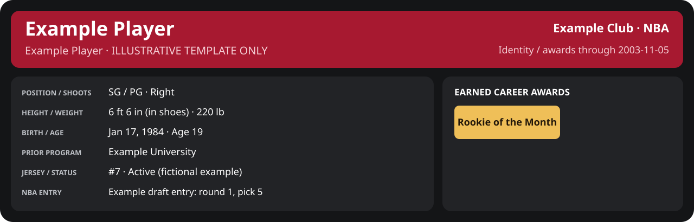

> **ILLUSTRATIVE TEMPLATE ONLY.** All games, teams, dates and performance figures below are invented for layout testing. They are not Wade's career results or a simulated future outcome.

<!-- Generated by scripts/update_player_reports.py; edit source records, then rebuild. -->

# Example Player | 2003-11-05 vs Club D

[Preview index](player_stats_preview.md)

## Professional identity

Personal information and earned awards: text version

| Player | Age on report date | Team / league | Position | Number | Status |
| --- | --- | --- | --- | --- | --- |
| Example Player | 19 | Example Club / NBA | SG / PG | 7 | Active (fictional example) |

| Birth date | Height (in shoes) | Weight | Shoots | Prior program |
| --- | --- | --- | --- | --- |
| 1984-01-17 | 6 ft 6 in | 220 lb | Right | Example University |

NBA entry: Example draft entry: round 1, pick 5.

Identity as of 2003-11-05; status snapshot dated 2003-10-01. Illustrative player identity; not a canonical career record.

### Earned career awards

| Award | Period | Announced | Decision record |
| --- | --- | --- | --- |
| Rookie of the Month | 2003-10-01 to 2003-10-31 | 2003-11-01 | ROTM (example) |

## Statistics

As of **2003-11-05**: 1 closed games; 1/1 have player participation and box coverage; recorded DNPs: 0.

G counts appearances; GS counts recorded starts. DNPs, scheduled games and canceled games do not enter per-game denominators.

### Per game

  

[Interactive Shooting](player_cards_preview.html?period=game-4#shooting) · [Interactive Contract](player_cards_preview.html#contract) · [Interactive Awards](player_cards_preview.html#awards) · [Shooting text version](sample_shooting.md) · [Contract text version](sample_contract.md) · [Awards text version](sample_awards.md)

| Scope | Age | Team | Lg | Pos | G | GS | MP | FG | FGA | FG% | 3P | 3PA | 3P% | 2P | 2PA | 2P% | eFG% | FT | FTA | FT% | ORB | DRB | TRB | AST | STL | BLK | TOV | PF | PTS | TS% (est.) | Awards |
| --- | --- | --- | --- | --- | --- | --- | --- | --- | --- | --- | --- | --- | --- | --- | --- | --- | --- | --- | --- | --- | --- | --- | --- | --- | --- | --- | --- | --- | --- | --- | --- |
| This scope | 19 | Example Club | NBA | SG / PG | 1 | 1 | 38.0 | 11.0 | 21.0 | .524 | 2.0 | 4.0 | .500 | 9.0 | 17.0 | .529 | .571 | 7.0 | 8.0 | .875 | 3.0 | 7.0 | 10.0 | 8.0 | 2.0 | 2.0 | 3.0 | 4.0 | 31.0 | .632 | — |

G and GS are counts; MP and counting statistics are **per appearance**. Shooting uses **.500 = 50.0%**. Age is at the row's cutoff. Scroll horizontally for every column.

Awards are confirmed through 2003-11-12, filed by the honor's period-end date; the banner shows career awards known at the page's identity cutoff.

### Production

| Metric | Total | Per appearance | Per 36 minutes |
| --- | --- | --- | --- |
| MIN | 38.0 | 38.0 | 36.0 |
| PTS | 31 | 31.0 | 29.4 |
| OREB | 3 | 3.0 | 2.8 |
| DREB | 7 | 7.0 | 6.6 |
| REB | 10 | 10.0 | 9.5 |
| AST | 8 | 8.0 | 7.6 |
| STL | 2 | 2.0 | 1.9 |
| BLK | 2 | 2.0 | 1.9 |
| TOV | 3 | 3.0 | 2.8 |
| PF | 4 | 4.0 | 3.8 |
| FGM | 11 | 11.0 | 10.4 |
| FGA | 21 | 21.0 | 19.9 |
| 2PM | 9 | 9.0 | 8.5 |
| 2PA | 17 | 17.0 | 16.1 |
| 3PM | 2 | 2.0 | 1.9 |
| 3PA | 4 | 4.0 | 3.8 |
| FTM | 7 | 7.0 | 6.6 |
| FTA | 8 | 8.0 | 7.6 |
| FT points | 7 | 7.0 | 6.6 |

Per-36 rates standardize playing time; they are not a projection of playing 36 minutes. Use the actual minutes denominator in every competition.

### Shooting

| Shot type | Makes | Attempts | Percentage |
| --- | --- | --- | --- |
| All field goals | 11 | 21 | 52.4% |
| Two-pointers | 9 | 17 | 52.9% |
| Three-pointers | 2 | 4 | 50.0% |
| Free throws | 7 | 8 | 87.5% |

### Efficiency and shot selection

| Metric | Value | Calculation / unit |
| --- | --- | --- |
| eFG% | 57.1% | (FGM + 0.5 × 3PM) / FGA |
| TS% (estimated) | 63.2% | PTS / [2 × (FGA + 0.44 × FTA)] |
| Three-point attempt share | 19.0% | 3PA / FGA |
| Free-throw attempt rate | 0.381 | FTA / FGA; ratio |
| Assist / turnover ratio | 2.67 | AST / TOV; N/A at zero turnovers |
| Plus/minus total | 9 | Observed on-court score differential only |
| Double-doubles | 1 | At least 10 in any two of PTS, REB, AST, STL, BLK |
| Triple-doubles | 0 | At least 10 in any three; also included in double-doubles |

Percentages use pooled makes and attempts. TS% uses an estimated free-throw weighting, not exact scoring possessions. Rounding is display-only.

### Splits

  

[Interactive Shooting](player_cards_preview.html?period=game-4#shooting) · [Interactive Contract](player_cards_preview.html#contract) · [Interactive Awards](player_cards_preview.html#awards) · [Shooting text version](sample_shooting.md) · [Contract text version](sample_contract.md) · [Awards text version](sample_awards.md)

| Scope | Age | Team | Lg | Pos | G | GS | MP | FG | FGA | FG% | 3P | 3PA | 3P% | 2P | 2PA | 2P% | eFG% | FT | FTA | FT% | ORB | DRB | TRB | AST | STL | BLK | TOV | PF | PTS | TS% (est.) | Awards |
| --- | --- | --- | --- | --- | --- | --- | --- | --- | --- | --- | --- | --- | --- | --- | --- | --- | --- | --- | --- | --- | --- | --- | --- | --- | --- | --- | --- | --- | --- | --- | --- |
| Home | 19 | Example Club | NBA | SG / PG | 0 | N/A | N/A | N/A | N/A | N/A | N/A | N/A | N/A | N/A | N/A | N/A | N/A | N/A | N/A | N/A | N/A | N/A | N/A | N/A | N/A | N/A | N/A | N/A | N/A | N/A | — |
| Away | 19 | Example Club | NBA | SG / PG | 1 | 1 | 38.0 | 11.0 | 21.0 | .524 | 2.0 | 4.0 | .500 | 9.0 | 17.0 | .529 | .571 | 7.0 | 8.0 | .875 | 3.0 | 7.0 | 10.0 | 8.0 | 2.0 | 2.0 | 3.0 | 4.0 | 31.0 | .632 | — |
| Neutral | 19 | Example Club | NBA | SG / PG | 0 | N/A | N/A | N/A | N/A | N/A | N/A | N/A | N/A | N/A | N/A | N/A | N/A | N/A | N/A | N/A | N/A | N/A | N/A | N/A | N/A | N/A | N/A | N/A | N/A | N/A | — |
| Wins | 19 | Example Club | NBA | SG / PG | 1 | 1 | 38.0 | 11.0 | 21.0 | .524 | 2.0 | 4.0 | .500 | 9.0 | 17.0 | .529 | .571 | 7.0 | 8.0 | .875 | 3.0 | 7.0 | 10.0 | 8.0 | 2.0 | 2.0 | 3.0 | 4.0 | 31.0 | .632 | — |
| Losses | 19 | Example Club | NBA | SG / PG | 0 | N/A | N/A | N/A | N/A | N/A | N/A | N/A | N/A | N/A | N/A | N/A | N/A | N/A | N/A | N/A | N/A | N/A | N/A | N/A | N/A | N/A | N/A | N/A | N/A | N/A | — |
| Team: Example Club | 19 | Example Club | NBA | SG / PG | 1 | 1 | 38.0 | 11.0 | 21.0 | .524 | 2.0 | 4.0 | .500 | 9.0 | 17.0 | .529 | .571 | 7.0 | 8.0 | .875 | 3.0 | 7.0 | 10.0 | 8.0 | 2.0 | 2.0 | 3.0 | 4.0 | 31.0 | .632 | — |

G and GS are counts; MP and counting statistics are **per appearance**. Shooting uses **.500 = 50.0%**. Age is at the row's cutoff. Scroll horizontally for every column.

Awards are confirmed through 2003-11-12, filed by the honor's period-end date; the banner shows career awards known at the page's identity cutoff.

Splits overlap and are not additive. Each row has its own appearance denominator; games with unknown result classification are excluded from win/loss splits.

### Game highs

| Metric | High | Date / opponent (all ties) |
| --- | --- | --- |
| PTS | 31 | [2003-11-05 vs Club D](sample_game_4.md) |
| REB | 10 | [2003-11-05 vs Club D](sample_game_4.md) |
| AST | 8 | [2003-11-05 vs Club D](sample_game_4.md) |
| STL | 2 | [2003-11-05 vs Club D](sample_game_4.md) |
| BLK | 2 | [2003-11-05 vs Club D](sample_game_4.md) |
| TOV | 3 | [2003-11-05 vs Club D](sample_game_4.md) |

### Game log

| Date / source | Opponent | Venue | Result | Participation | MIN | PTS | REB | AST | STL | BLK | TOV |
| --- | --- | --- | --- | --- | --- | --- | --- | --- | --- | --- | --- |
| [2003-11-05](sample_game_4.md) | Club D | away | W 102-96 | Played | 38.0 | 31 | 10 | 8 | 2 | 2 | 3 |

### Game shooting detail

| Date / source | FG | 2P | 3P | FT | eFG% | TS% (est.) | +/- | PF |
| --- | --- | --- | --- | --- | --- | --- | --- | --- |
| [2003-11-05](sample_game_4.md) | 11/21 | 9/17 | 2/4 | 7/8 | 57.1% | 63.2% | 9 | 4 |

### Additional data needed

| Statistic family | Current support | Required evidence |
| --- | --- | --- |
| Starts; plus/minus | N/A unless supplied in the player box | Explicit started and plus_minus fields |
| Per 100 possessions; offensive / defensive / net rating | Unavailable in current box feed | Player on-court possessions and both teams' scoring during those possessions |
| USG%; AST%; OREB%, DREB%, REB% | Unavailable in current box feed | Matching player/team/opponent opportunity counts and a declared method |
| Rim, paint, midrange, corner / above-break threes | Unavailable in current box feed | Shot locations, attempts and makes |
| Drives, touches, catch-and-shoot, pull-ups, play types | Unavailable in current box feed | Tracking or tagged play-by-play |
| Clutch, on/off, lineup combinations, assisted baskets | Unavailable in current box feed | Timed events, score state, substitutions and possession attribution |
| Deflections, charges, contested shots, box outs | Unavailable in current box feed | Observed hustle/defensive events |
| League rank, percentile, relative TS%; impact models | Not derived by this report | Same-period simulated league baseline, eligibility rules and documented model |
