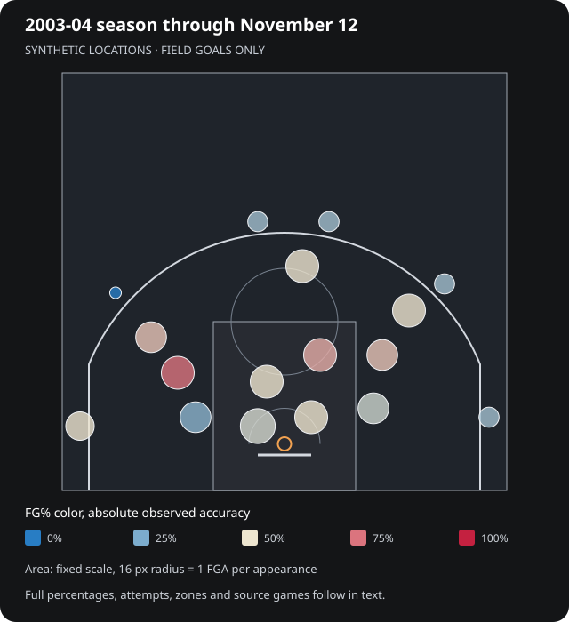
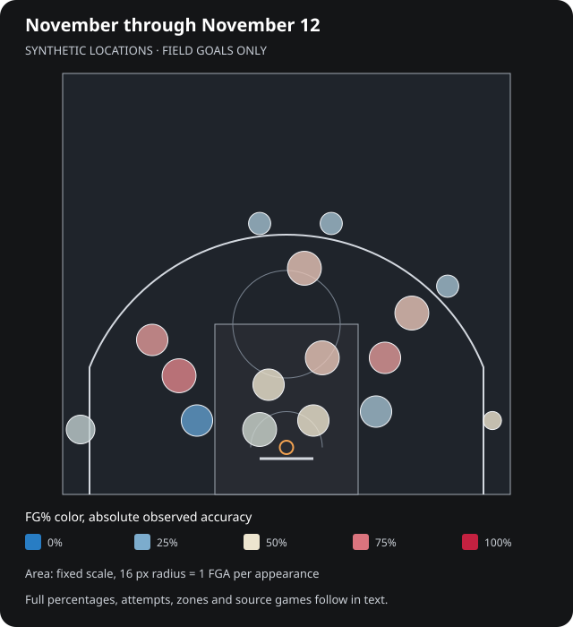
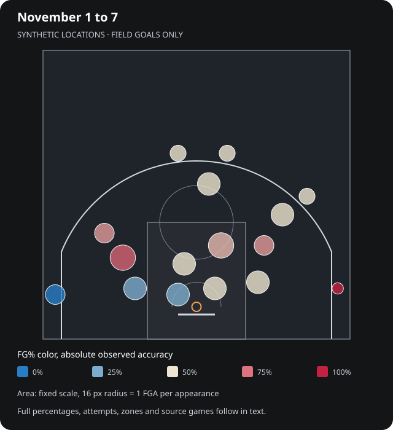
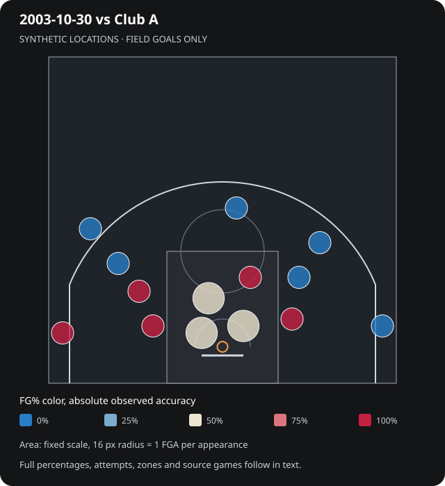
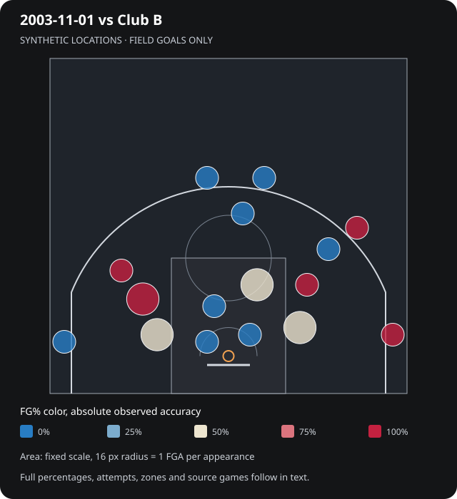
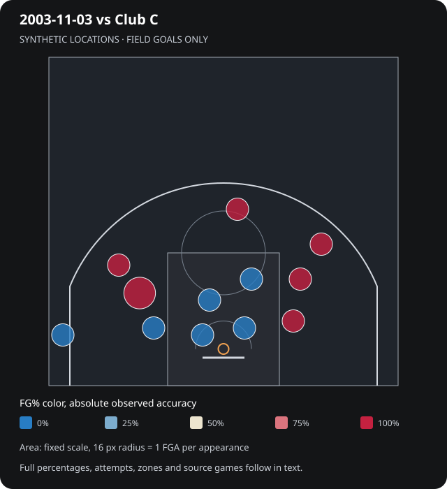
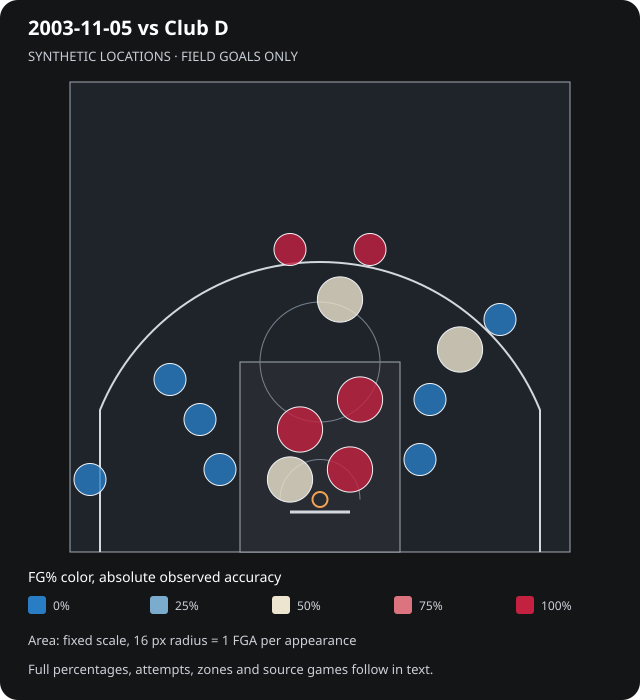
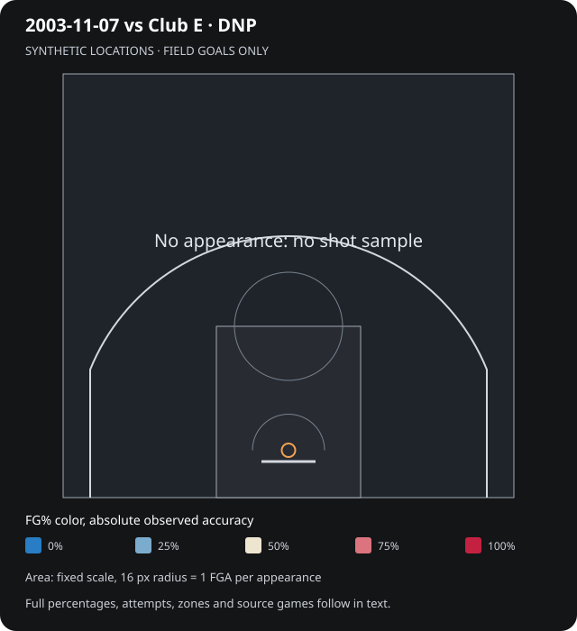
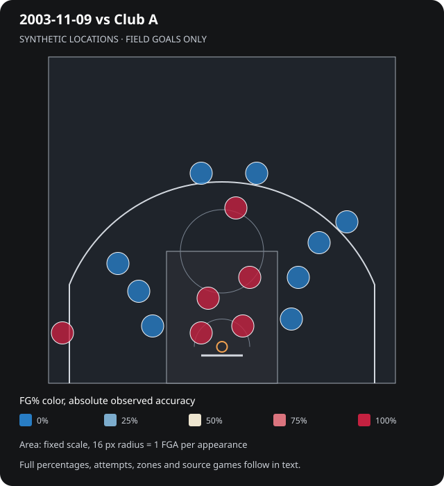
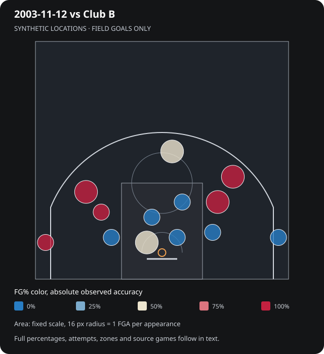

# Shooting | Example Player

> **ILLUSTRATIVE TEMPLATE ONLY.** All games, teams, dates and performance figures below are invented for layout testing. They are not Wade's career results or a simulated future outcome.

[Open interactive Shooting](player_cards_preview.html#shooting) · [Statistics index](player_stats_preview.md) · [Contract](sample_contract.md) · [Awards](sample_awards.md)

Shot coordinates are **synthetic design fixtures**, explicitly generated to reconcile with the six existing fictional game boxes. They are not inferred real locations or canonical tracking. Free throws contribute to PTS but never appear as field-goal dots.

**Read the map:** circle area represents field-goal attempts per appearance, using one fixed scale across periods. Color represents absolute observed FG%, with no invented league benchmark. Hover inspection and selectors are in the interactive version; the complete values remain below.

[Season](#season) · [Month](#month) · [Week](#week) · [Game 1](#game-1) · [Game 2](#game-2) · [Game 3](#game-3) · [Game 4](#game-4) · [Dnp](#dnp) · [Game 5](#game-5) · [Game 6](#game-6)

## Season

**2003-04 season through November 12** · 6 appearances · 1 DNP · Cutoff 2003-11-12.

[Open this period interactively](player_cards_preview.html?period=season#shooting)

| Zone | FGM | FGA | FG% | FG points / game | FGA / game |
| --- | ---: | ---: | ---: | ---: | ---: |
| Paint | 17 | 33 | 51.5% | 5.67 | 5.50 |
| Outside paint, under 12 ft | 5 | 14 | 35.7% | 1.67 | 2.33 |
| Outside paint, 12 to under 18 ft | 10 | 15 | 66.7% | 3.33 | 2.50 |
| 18 ft to the three-point line | 12 | 23 | 52.2% | 4.00 | 3.83 |
| Three-point range | 7 | 19 | 36.8% | 3.50 | 3.17 |
| All field goals | 51 | 104 | 49.0% | 18.17 | 17.33 |

Coverage: **complete**; 104 located attempts, 0 unlocated, 0 outside this view, 0 missing.

Source games: [2003-10-30 vs Club A](sample_game_1.md) · [2003-11-01 vs Club B](sample_game_2.md) · [2003-11-03 vs Club C](sample_game_3.md) · [2003-11-05 vs Club D](sample_game_4.md) · [2003-11-07 vs Club E](sample_dnp.md) · [2003-11-09 vs Club A](sample_game_5.md) · [2003-11-12 vs Club B](sample_game_6.md).

## Month

**November through November 12** · 5 appearances · 1 DNP · Cutoff 2003-11-12.

[Open this period interactively](player_cards_preview.html?period=month#shooting)

| Zone | FGM | FGA | FG% | FG points / game | FGA / game |
| --- | ---: | ---: | ---: | ---: | ---: |
| Paint | 13 | 26 | 50.0% | 5.20 | 5.20 |
| Outside paint, under 12 ft | 3 | 12 | 25.0% | 1.20 | 2.40 |
| Outside paint, 12 to under 18 ft | 9 | 13 | 69.2% | 3.60 | 2.60 |
| 18 ft to the three-point line | 12 | 20 | 60.0% | 4.80 | 4.00 |
| Three-point range | 6 | 16 | 37.5% | 3.60 | 3.20 |
| All field goals | 43 | 87 | 49.4% | 18.40 | 17.40 |

Coverage: **complete**; 87 located attempts, 0 unlocated, 0 outside this view, 0 missing.

Source games: [2003-11-01 vs Club B](sample_game_2.md) · [2003-11-03 vs Club C](sample_game_3.md) · [2003-11-05 vs Club D](sample_game_4.md) · [2003-11-07 vs Club E](sample_dnp.md) · [2003-11-09 vs Club A](sample_game_5.md) · [2003-11-12 vs Club B](sample_game_6.md).

## Week

**November 1 to 7** · 3 appearances · 1 DNP · Cutoff 2003-11-07.

[Open this period interactively](player_cards_preview.html?period=week#shooting)

| Zone | FGM | FGA | FG% | FG points / game | FGA / game |
| --- | ---: | ---: | ---: | ---: | ---: |
| Paint | 8 | 17 | 47.1% | 5.33 | 5.67 |
| Outside paint, under 12 ft | 3 | 8 | 37.5% | 2.00 | 2.67 |
| Outside paint, 12 to under 18 ft | 6 | 8 | 75.0% | 4.00 | 2.67 |
| 18 ft to the three-point line | 6 | 11 | 54.5% | 4.00 | 3.67 |
| Three-point range | 4 | 10 | 40.0% | 4.00 | 3.33 |
| All field goals | 27 | 54 | 50.0% | 19.33 | 18.00 |

Coverage: **complete**; 54 located attempts, 0 unlocated, 0 outside this view, 0 missing.

Source games: [2003-11-01 vs Club B](sample_game_2.md) · [2003-11-03 vs Club C](sample_game_3.md) · [2003-11-05 vs Club D](sample_game_4.md) · [2003-11-07 vs Club E](sample_dnp.md).

## Game 1

**2003-10-30 vs Club A** · 1 appearances · 0 DNP · Cutoff 2003-10-30.

[Open this period interactively](player_cards_preview.html?period=game-1#shooting)

| Zone | FGM | FGA | FG% | FG points / game | FGA / game |
| --- | ---: | ---: | ---: | ---: | ---: |
| Paint | 4 | 7 | 57.1% | 8.00 | 7.00 |
| Outside paint, under 12 ft | 2 | 2 | 100.0% | 4.00 | 2.00 |
| Outside paint, 12 to under 18 ft | 1 | 2 | 50.0% | 2.00 | 2.00 |
| 18 ft to the three-point line | 0 | 3 | 0.0% | 0.00 | 3.00 |
| Three-point range | 1 | 3 | 33.3% | 3.00 | 3.00 |
| All field goals | 8 | 17 | 47.1% | 17.00 | 17.00 |

Coverage: **complete**; 17 located attempts, 0 unlocated, 0 outside this view, 0 missing.

Source games: [2003-10-30 vs Club A](sample_game_1.md).

## Game 2

**2003-11-01 vs Club B** · 1 appearances · 0 DNP · Cutoff 2003-11-01.

[Open this period interactively](player_cards_preview.html?period=game-2#shooting)

| Zone | FGM | FGA | FG% | FG points / game | FGA / game |
| --- | ---: | ---: | ---: | ---: | ---: |
| Paint | 1 | 5 | 20.0% | 2.00 | 5.00 |
| Outside paint, under 12 ft | 2 | 4 | 50.0% | 4.00 | 4.00 |
| Outside paint, 12 to under 18 ft | 3 | 3 | 100.0% | 6.00 | 3.00 |
| 18 ft to the three-point line | 1 | 3 | 33.3% | 2.00 | 3.00 |
| Three-point range | 2 | 5 | 40.0% | 6.00 | 5.00 |
| All field goals | 9 | 20 | 45.0% | 20.00 | 20.00 |

Coverage: **complete**; 20 located attempts, 0 unlocated, 0 outside this view, 0 missing.

Source games: [2003-11-01 vs Club B](sample_game_2.md).

## Game 3

**2003-11-03 vs Club C** · 1 appearances · 0 DNP · Cutoff 2003-11-03.

[Open this period interactively](player_cards_preview.html?period=game-3#shooting)

| Zone | FGM | FGA | FG% | FG points / game | FGA / game |
| --- | ---: | ---: | ---: | ---: | ---: |
| Paint | 0 | 4 | 0.0% | 0.00 | 4.00 |
| Outside paint, under 12 ft | 1 | 2 | 50.0% | 2.00 | 2.00 |
| Outside paint, 12 to under 18 ft | 3 | 3 | 100.0% | 6.00 | 3.00 |
| 18 ft to the three-point line | 3 | 3 | 100.0% | 6.00 | 3.00 |
| Three-point range | 0 | 1 | 0.0% | 0.00 | 1.00 |
| All field goals | 7 | 13 | 53.8% | 14.00 | 13.00 |

Coverage: **complete**; 13 located attempts, 0 unlocated, 0 outside this view, 0 missing.

Source games: [2003-11-03 vs Club C](sample_game_3.md).

## Game 4

**2003-11-05 vs Club D** · 1 appearances · 0 DNP · Cutoff 2003-11-05.

[Open this period interactively](player_cards_preview.html?period=game-4#shooting)

| Zone | FGM | FGA | FG% | FG points / game | FGA / game |
| --- | ---: | ---: | ---: | ---: | ---: |
| Paint | 7 | 8 | 87.5% | 14.00 | 8.00 |
| Outside paint, under 12 ft | 0 | 2 | 0.0% | 0.00 | 2.00 |
| Outside paint, 12 to under 18 ft | 0 | 2 | 0.0% | 0.00 | 2.00 |
| 18 ft to the three-point line | 2 | 5 | 40.0% | 4.00 | 5.00 |
| Three-point range | 2 | 4 | 50.0% | 6.00 | 4.00 |
| All field goals | 11 | 21 | 52.4% | 24.00 | 21.00 |

Coverage: **complete**; 21 located attempts, 0 unlocated, 0 outside this view, 0 missing.

Source games: [2003-11-05 vs Club D](sample_game_4.md).

## Dnp

**2003-11-07 vs Club E · DNP** · 0 appearances · 1 DNP · Cutoff 2003-11-07.

[Open this period interactively](player_cards_preview.html?period=dnp#shooting)

| Zone | FGM | FGA | FG% | FG points / game | FGA / game |
| --- | ---: | ---: | ---: | ---: | ---: |
| Paint | 0 | 0 | N/A | N/A | N/A |
| Outside paint, under 12 ft | 0 | 0 | N/A | N/A | N/A |
| Outside paint, 12 to under 18 ft | 0 | 0 | N/A | N/A | N/A |
| 18 ft to the three-point line | 0 | 0 | N/A | N/A | N/A |
| Three-point range | 0 | 0 | N/A | N/A | N/A |
| All field goals | 0 | 0 | N/A | N/A | N/A |

Coverage: **complete**; 0 located attempts, 0 unlocated, 0 outside this view, 0 missing.

A DNP has no appearance and no shooting-percentage sample. Zero attempts do not mean 0.0% shooting.

Source games: [2003-11-07 vs Club E](sample_dnp.md).

## Game 5

**2003-11-09 vs Club A** · 1 appearances · 0 DNP · Cutoff 2003-11-09.

[Open this period interactively](player_cards_preview.html?period=game-5#shooting)

| Zone | FGM | FGA | FG% | FG points / game | FGA / game |
| --- | ---: | ---: | ---: | ---: | ---: |
| Paint | 4 | 4 | 100.0% | 8.00 | 4.00 |
| Outside paint, under 12 ft | 0 | 2 | 0.0% | 0.00 | 2.00 |
| Outside paint, 12 to under 18 ft | 0 | 2 | 0.0% | 0.00 | 2.00 |
| 18 ft to the three-point line | 1 | 3 | 33.3% | 2.00 | 3.00 |
| Three-point range | 1 | 4 | 25.0% | 3.00 | 4.00 |
| All field goals | 6 | 15 | 40.0% | 13.00 | 15.00 |

Coverage: **complete**; 15 located attempts, 0 unlocated, 0 outside this view, 0 missing.

Source games: [2003-11-09 vs Club A](sample_game_5.md).

## Game 6

**2003-11-12 vs Club B** · 1 appearances · 0 DNP · Cutoff 2003-11-12.

[Open this period interactively](player_cards_preview.html?period=game-6#shooting)

| Zone | FGM | FGA | FG% | FG points / game | FGA / game |
| --- | ---: | ---: | ---: | ---: | ---: |
| Paint | 1 | 5 | 20.0% | 2.00 | 5.00 |
| Outside paint, under 12 ft | 0 | 2 | 0.0% | 0.00 | 2.00 |
| Outside paint, 12 to under 18 ft | 3 | 3 | 100.0% | 6.00 | 3.00 |
| 18 ft to the three-point line | 5 | 6 | 83.3% | 10.00 | 6.00 |
| Three-point range | 1 | 2 | 50.0% | 3.00 | 2.00 |
| All field goals | 10 | 18 | 55.6% | 21.00 | 18.00 |

Coverage: **complete**; 18 located attempts, 0 unlocated, 0 outside this view, 0 missing.

Source games: [2003-11-12 vs Club B](sample_game_6.md).

Zones are non-overlapping: three-point range first, then the paint, then outside-paint distance bands. A coordinate on the three-point line remains a two-point shot. Percentages are pooled makes divided by pooled attempts, never averages of game percentages.

[Raw synthetic shot fixture](illustrative_shots.json) · [Period payload](player_cards_data.json) · [Definitions and implementation boundaries](../shooting_and_awards_design.md)
