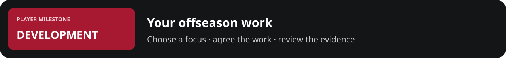

# Summer work | {{player}}

[Template collection](README.md) · [Filled example](../../examples/player_milestones/offseason_training.md)

| Player / age | Position / club | Block dates | Availability |
| --- | --- | --- | --- |
| {{name; age}} | {{position; club/status}} | {{start to review date}} | {{staff-recorded clearance, limits and date}} |

**Your next decision:** choose one primary focus and one maintenance priority.

**Staff recommendation:** {{focus and observed reason}}

**Calendar constraints:** {{contract meetings, recovery, travel, national-team or Summer League commitments actually recorded}}

## Choose what this block is for

| Focus | Evidence behind it | Work to discuss with staff | What receives less attention |
| --- | --- | --- | --- |
| {{skill A}} | {{film/source sample, not a guessed weakness}} | {{drill family and game situation}} | {{competing skill/time}} |
| {{skill B}} | {{observed issue and sample}} | {{planned work}} | {{tradeoff}} |
| {{skill C}} | {{player goal and current evidence}} | {{planned work}} | {{tradeoff}} |

**Your selection:** {{primary + maintenance focus}}

**What success would look like:** {{observable change under a repeatable test; a target is not a promised result}}

## The agreed block

| Session / date | Planned work | Staff-agreed load / duration | Location / support | Actual completion |
| --- | --- | --- | --- | --- |
| {{session 1}} | {{skill work}} | {{agreed amount}} | {{coach/facility}} | Planned |
| {{session 2}} | {{film and decision work}} | {{agreed amount}} | {{support}} | Planned |
| {{session 3}} | {{strength/conditioning per staff plan}} | {{agreed amount}} | {{support}} | Planned |
| {{recovery / open day}} | {{recovery or scheduled rest}} | {{staff plan}} | {{support}} | Planned |

Training volume follows the player's current clearance and qualified staff plan. A reported symptom goes back to staff; the player can report how he feels but cannot self-clear a restriction. Record completed work separately from planned work.

## Review the work, not just the intention

| Measure / exact drill | Baseline and sample | This block and sample | What the comparison supports |
| --- | --- | --- | --- |
| {{shot type, distance, contest and fatigue conditions}} | {{makes/attempts; date}} | {{makes/attempts; date}} | {{same protocol? enough observations?}} |
| {{decision drill / film tag}} | {{correct reads/opportunities}} | {{same denominator definition}} | {{observation}} |
| {{attendance / workload}} | {{planned sessions and time}} | {{completed sessions and time}} | {{adherence and adjustments}} |

Practice shooting, scrimmages and NBA games remain separate samples. Training selection does not award rating points or guarantee a higher NBA percentage. Only supported development resolution can affect the simulation's ability model.

**Your reply:** “My primary focus is {{focus}}; maintain {{skill}}. I want to discuss {{adjustment}}.”

**At the review:** continue, modify, or close the block with a recorded reason.

**Next checkpoint:** {{review date; who reviews; what evidence will be available}}.
